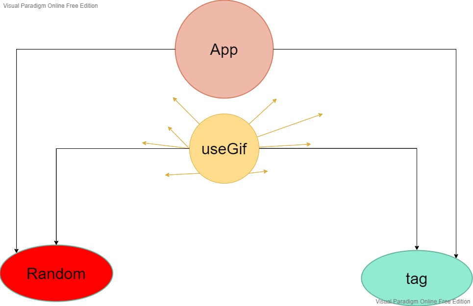

**Author: Saddam maratouq**

 project :   **Random-gif** 

# overview 

1- this app can run Random gif with tag input and without tag 

2- I use  custom hook to control the   both component Tag ,Random

--- 

**Dependencies needs to install**

     npm i axios 
    
---

**UML/Application** 

